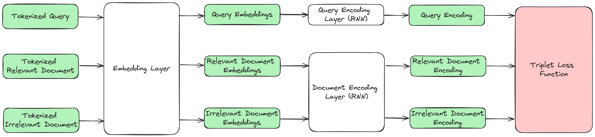

# Two Tower Search Engine

This week's project focuses on building a search engine that processes queries and returns a ranked list of relevant documents. The project leverages the **Two Tower architecture** and is trained on the **Microsoft Machine Reading Comprehension (MS MARCO)** dataset.

---

## Overview

The goal is to implement a search engine using a deep learning approach. The architecture will encode queries and documents separately, compare their representations, and rank documents based on relevance.

---

## Dataset

We will use the **MS MARCO** dataset, a collection of datasets designed for deep learning tasks related to search. You can find more details about the dataset on its [official website](https://microsoft.github.io/msmarco/) and download version 1.1 from [HuggingFace](https://huggingface.co/).

### Dataset Preparation Steps:
1. **Download the dataset** from MS MARCO.
2. **Split the dataset** into training, validation, and test sets.
3. **Extract queries and documents** from the dataset.
4. **Generate triples** of:
   - Queries
   - Relevant (positive) documents
   - Irrelevant (negative) documents (using negative sampling).
5. **Tokenize the data** for input into the model.

---

## Model Architecture

The **Two Tower architecture** consists of two parallel encoding layers: one for queries and one for documents. The architecture is designed to compare query and document representations effectively.

### Key Components:
1. **Token Embedding Layer**:
   - Pretrained word embeddings (e.g., Word2Vec).
   - Optionally fine-tuned or frozen during training.

2. **Encoding Layers**:
   - Two separate RNN-based layers:
     - One for encoding queries.
     - One for encoding documents (both positive and negative).
   - RNNs are used to preserve sequential information, such as word order.

3. **Distance Function**:
   - Measures similarity between query and document encodings.
   - Higher similarity indicates a more relevant document.

4. **Triplet Loss Function**:
   - Trains the model to minimize the distance between queries and relevant documents.
   - Maximizes the distance between queries and irrelevant documents.

---

## Training Process

1. **Input**: Tokenized triples of queries, positive documents, and negative documents.
2. **Forward Pass**:
   - Encode queries and documents using the Two Tower architecture.
   - Compute similarity scores using the distance function.
3. **Loss Calculation**:
   - Use the triplet loss function to optimize the model.
4. **Backpropagation**:
   - Update model weights to improve performance.

---

## Inference

1. **Pre-cache Document Encodings**:
   - Encode and store representations of all documents in advance.
2. **Query Encoding**:
   - Encode the incoming query using the query encoder.
3. **Similarity Scoring**:
   - Use the distance function to compute similarity between the query and all document encodings.
4. **Ranking**:
   - Rank documents based on similarity scores.
   - Return the top 5 most relevant documents.

---

## Target Model Architecture

Below is a visual representation of the target model architecture:



---

## Getting Started

### Prerequisites
- Python 3.8+
- TensorFlow or PyTorch
- HuggingFace Datasets library
- Pretrained Word2Vec embeddings

### Installation
1. Clone the repository:
   ```bash
   git clone https://github.com/your-repo/ml-institute-week-2-two-towers.git
   cd ml-institute-week-2-two-towers
   ```
2. Install dependencies:
   ```bash
   pip install -r requirements.txt
   ```

### Running the Project
1. Prepare the dataset:
   ```bash
   python prepare_dataset.py
   ```
2. Train the model:
   ```bash
   python train.py
   ```
3. Run inference:
   ```bash
   python inference.py --query "Your search query here"
   ```

---

## References

- [MS MARCO Dataset](https://microsoft.github.io/msmarco/)
- [HuggingFace Datasets](https://huggingface.co/)
- [Word2Vec](https://en.wikipedia.org/wiki/Word2vec)

---

## License

This project is licensed under the MIT License. See the [LICENSE](LICENSE) file for details.